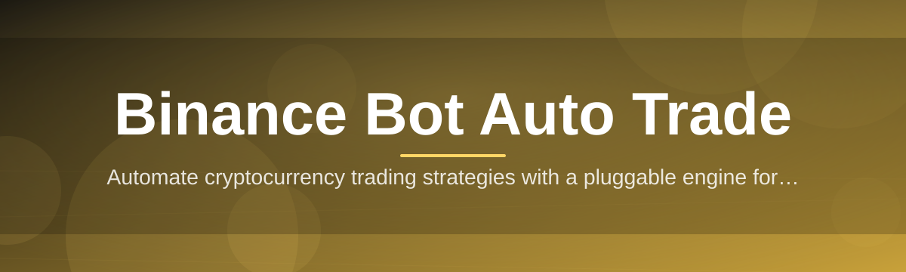
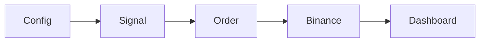

# bnb-trade-bot-controller 🤖📈

  

*A calm, focused control panel for your Binance auto trade bot — built for people who'd rather watch candles than watch consoles.*

## 🌱 Overview

Every project has an origin story, and this one starts with a spreadsheet. Three spreadsheets, actually — each one tracking a different set of trading parameters across a different exchange session, because juggling a Binance bot through raw API scripts and terminal windows was turning into a part-time job nobody signed up for. `bnb-trade-bot-controller` was born out of that frustration: a single desktop controller that wraps the noisy mechanics of automated Binance trading into something you can actually glance at, trust, and adjust without breaking a sweat.

At its core, this is a Windows-native control layer for Binance Bot Auto Trade workflows — grid strategies, DCA ladders, signal-based entries, and simple trend-following logic — all steered from one clean dashboard instead of a patchwork of scripts. It talks to your Binance account through your own API credentials, executes according to the rules you configure, and reports back in real time so you're never guessing what your bot is doing at 3 AM.

This tool is for the solo trader who wants automation without opacity, the tinkerer who likes tuning strategies but hates babysitting terminals, and the cautious investor who wants a kill switch within one click at all times. It's not a magic profit machine — it's a steering wheel for a car you still have to choose where to drive.

  

---

## ⚡ What Makes It Tick

  

- **Strategy dashboard that actually breathes** — live P&L, open orders, and bot heartbeat rendered in a layout that updates without flicker, so you can leave it on a second monitor all day.

- **One-click pause, not one-click panic** — every running strategy has an instant halt switch that freezes new orders while letting existing positions resolve safely.

- **Multi-pair orchestration** — run several trading pairs under independent rule sets simultaneously, each with its own risk ceiling, without spinning up separate processes.

- **Configurable risk guardrails** — set max drawdown, position size caps, and cooldown windows once, and the controller enforces them even if a strategy misbehaves.

- **Local-first credential handling** — your Binance API keys stay on your machine inside an encrypted local store; nothing routes through a third-party relay server.

- **Session replay logs** — every trade decision is timestamped and logged, so post-mortems on a bad session take minutes, not hours of scrollback hunting.

- **Adaptive polling** — the controller throttles its own request rate against Binance endpoint limits automatically, reducing the odds of rate-limit lockouts during volatile stretches.

- **Alert routing** — desktop notifications for fills, stop-outs, and connectivity drops, so the auto trade engine never fails silently.

<strong>🧩 Under-the-hood extras worth knowing about</strong>

 

> [!TIP]
> The controller ships with preset strategy templates (grid, DCA, momentum) that you can clone and tweak instead of building rules from a blank slate.

- Config profiles are portable — export a `.json` profile and hand it to another instance without retyping every parameter.

- The dashboard supports a compact "ticker bar" mode for users running it alongside charting software.

- Order execution includes a slippage guard that cancels and retries if fill price drifts past a configured tolerance.

<strong>🔬 Why a controller instead of raw scripts?</strong>

 

Raw scripts are fine until you need to change one number at 2 AM because the market moved. A controller turns "edit code, restart process, hope nothing broke" into "adjust a slider, watch the change apply live." That difference is the entire reason this project exists — it's automation you can actually supervise.

---

## 🚀 Getting Rolling

> [!NOTE]
> No package managers, no dependency chains, no terminal required. This is a standalone Windows application from download to first trade.

1. **Visit the landing page** using the download button above and grab the latest build for Windows.

2. **Launch the controller** — it opens straight into the dashboard, no setup wizard maze.

3. **Connect your Binance API key** (read + trade permissions only — never enable withdrawals) inside Settings.

4. **Pick a strategy template**, tune the risk guardrails to your comfort level, and press Start.

> [!IMPORTANT]
> Always test new configurations on a small position size before scaling up. Automated systems execute exactly what you tell them — including mistakes — at full speed.

---

## 💻 System Requirements

| Requirement | Details |
|---|---|
| OS | Windows 10 or Windows 11 (64-bit) |
| Dependencies | None — fully standalone executable |
| Storage | ~150 MB free disk space |
| Network | Stable internet connection for Binance API calls |
| Account | Binance account with API key (trade-enabled, withdrawal disabled) |

---

## 🛠️ How It Works

The architecture is intentionally simple — fewer moving parts means fewer surprises when real money is involved.

1. **Input** — you define strategy rules, pairs, and risk limits inside the dashboard.

2. **Signal engine** — the controller evaluates market data against your rules on each polling cycle.

3. **Execution layer** — qualifying signals are converted into Binance API order calls.

4. **Feedback loop** — fills, rejections, and balance changes flow back into the dashboard instantly.

5. **Guardrail check** — every cycle re-verifies your risk ceilings before allowing the next action.

---

## 🩺 Troubleshooting

<strong>My API key connects but no trades are firing — what gives?</strong>

 

Check that your strategy's entry conditions have actually been met on the selected pair — the controller won't force a trade just because it's running. Also confirm your API key has trading permissions enabled on Binance's side.

<strong>The controller shows "rate limit warning" — is my bot broken?</strong>

 

No — this is the adaptive polling guard doing its job. It automatically slows requests when you're near Binance's endpoint limits. Trading resumes normal cadence once the window clears.

<strong>Can I run multiple strategies on the same pair?</strong>

 

Technically yes, but it's not recommended — two independent rule sets competing for the same balance can create conflicting orders. Stick to one strategy per pair for predictable behavior.

<strong>Windows Defender flagged the executable — should I be worried?</strong>

 

This is common for newer, less widely-signed applications. Verify you downloaded from the official landing page linked in this README before allowing it through.

<strong>How do I fully stop everything in an emergency?</strong>

 

Use the global "Halt All" control in the top bar — it immediately stops new order placement across every running strategy, distinct from pausing a single strategy.

> [!WARNING]
> This controller does not guarantee profit and cannot predict market conditions. Automated trading carries real financial risk — never run strategies with funds you cannot afford to lose.

---

## 🎨 UI / UX Details

- **Themes**: Dark, Light, and a high-contrast "Candlelight" mode for late-night sessions.

- **Keyboard shortcuts**:

  | Shortcut | Action |
  |---|---|
  | `Ctrl+S` | Save current strategy profile |
  | `Ctrl+P` | Pause active strategy |
  | `Ctrl+Shift+H` | Halt all strategies |
  | `Ctrl+L` | Open session log viewer |
  | `Ctrl+,` | Open settings |

- **Persistent settings**: window layout, chosen theme, and last-used pairs are remembered between launches.

- **Compact mode**: collapses the dashboard into a slim ticker bar for multi-monitor setups.

---

## 🤝 Contributing & Community

This project grew because traders kept sharing their strategy templates and bug reports — that spirit is very much still alive.

> [!TIP]
> Found a rough edge or have a strategy template worth sharing? Open an issue or discussion thread on the repository — every report has shaped a real feature in this project.

- Star the repo if the controller saves you time — it genuinely helps visibility.

- Discussions are the best place for strategy-tuning questions.

- Issues are for bugs, crashes, and reproducible behavior problems.

---

## 📜 License

Released under the [MIT License](LICENSE), 2026.

---

## ⚠️ Disclaimer

`bnb-trade-bot-controller` is an independent tool and is not affiliated with, endorsed by, or officially connected to Binance in any way. Cryptocurrency trading, automated or otherwise, involves substantial risk of loss. This software is provided "as is" with no warranty of profitability or fitness for a particular purpose. Trade responsibly and never risk more than you can afford to lose.

  

